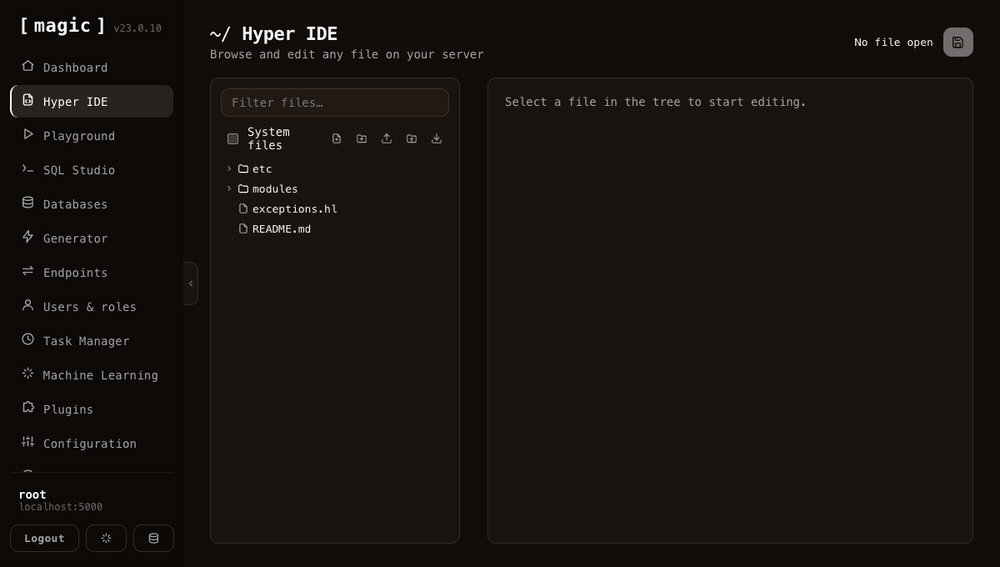
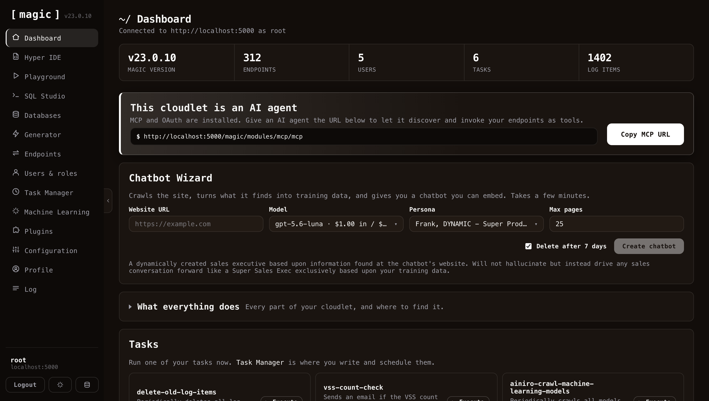
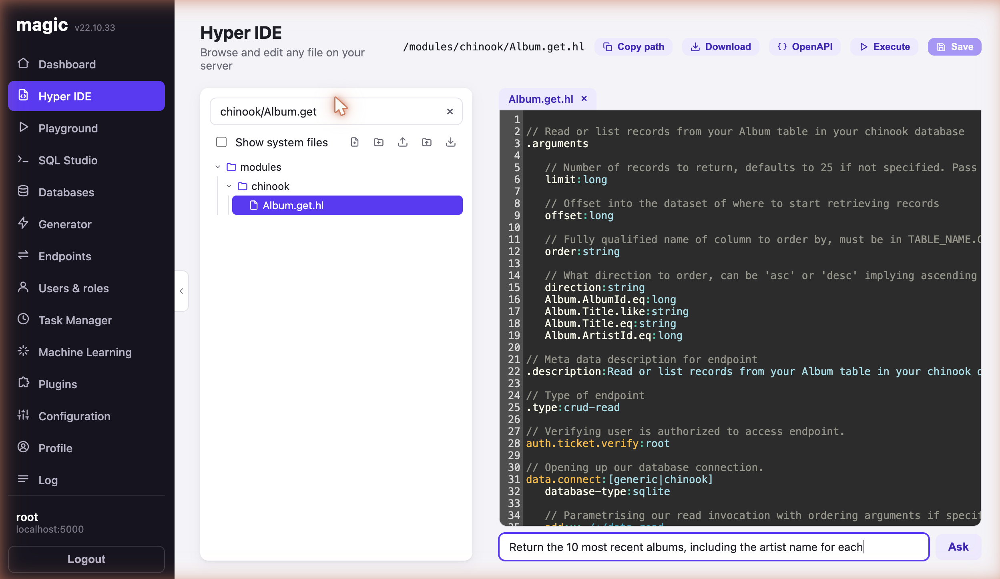

# Magic Cloud — Open Source, Self-Hosted AI App Builder and AI Agent Platform

Turn plain English into a working full-stack app — database, secure API, business logic, and frontend — running on **your own hardware**, with **zero lock-in**. An open-source alternative to Lovable, Bolt, and Replit that gives you the whole backend, plus an MCP server that turns every endpoint into a tool for Claude, Cursor, or Codex.

[](LICENSE)
[](https://github.com/polterguy/magic/stargazers)
[](https://dotnet.microsoft.com/)
[](frontend/)
[](https://hub.docker.com/r/servergardens/magic-backend)
[](#contributing)

## Run it in 60 seconds

```bash
curl -fsSL https://hyperlambda.dev/docker-compose.yaml | docker compose -f - up
```

Then open **`localhost:5555`**, point it at **`localhost:4444`**, and log in with `root` / `root`.



*Open any file on your server, execute it without a build or deploy step, and get the response back — parametrised, in milliseconds.*

⭐ **If this saves you time, star the repo** — it's the main way other developers find it.

## What you can build

* **Full-stack business apps** — CRM systems, admin panels, booking systems, internal tools; database, secure API and frontend generated from natural language
* **Database-driven AI agents** — agents that query and update *your* database and invoke *your* endpoints, behind your own role-based access control
* **AI chatbots and expert systems** — crawl a website, get an embeddable chatbot grounded in your own content
* **Secure APIs over legacy databases** — point it at an existing MySQL, PostgreSQL, SQL Server or MariaDB schema and get a CRUD API in seconds
* **MCP tool servers** — expose your endpoints to Claude, Cursor, Codex, Qoder or any MCP client
* **Background jobs and automation** — scheduled tasks written in Hyperlambda, or generated from a plain English description
* **Static sites and SPAs** — your cloudlet serves files directly, next to the APIs powering them

## How it compares

| | **Magic Cloud** | Lovable / Bolt | n8n / Zapier / Make |
| --- | --- | --- | --- |
| License | MIT, fully open source | Proprietary | Mixed |
| Self-hostable | Yes — your hardware, your data | No | Partly |
| Backend included | Database, API, auth, RBAC, jobs | Frontend + third-party BaaS | Workflows only |
| Deploy step before you can test | **None** — save and run | Deploy to third parties first | Publish step |
| Execution model | Compiled .NET runtime | — | Interprets JSON/YAML workflows |
| MCP server | Built in | No | No |
| Vendor lock-in | None | Yes | Yes |

## The LLM that cannot hallucinate functions

Magic runs Hyperlambda, which can be generated by our own proprietary LLM. Because we generate an **AST rather than text**, the output is analysed and rejected if it contains functions that don't exist. The Hyperlambda Generator **cannot return hallucinated function invocations** — like any LLM it can still write logically wrong code, but every function it invokes is guaranteed to exist.

Combined with the ability to restrict the vocabulary, this lets you ship AI agents that **grow their own tool space on demand**, without widening your attack surface.

## Unique security model

Hyperlambda runs sandboxed, with no file system access outside its sandbox, and can **whitelist individual functions** through its RBAC system — so your server can accept code as input and execute it safely without knowing where it came from. Restricting invocations at the *execution* level makes Hyperlambda, as far as we know, the only language that currently does this.

> I'm so confident in the codebase quality, I'll give you **$100** if you can find a severe security-related bug in its backend code — and another **$100** if you can exploit the [natural language API](https://ainiro.io/natural-language-api), which has accepted arbitrary public input for 3 months with nobody succeeding.

## MCP support — and an 80% token saving

Install the `mcp` plugin, point Claude Code, Cowork, or OpenAI's Codex at your cloudlet, and every HTTP endpoint in your `modules` folder becomes a tool the agent can invoke. In our measurements this also **cuts token consumption by roughly 80%**. Calculate your own savings [here](https://hyperlambda.dev/savings-calculator).


## Performance

In our measurements Hyperlambda is roughly **20× faster than FastAPI or Flask**, around **50× faster than LangChain**, and **100–1,000× faster than** graphical workflow tools such as n8n, Zapier and Make — because it runs a real compiled runtime instead of interpreting logic out of JSON, XML or YAML. Hyperlambda solutions are broadly on par with C# and Entity Framework on both performance and scalability.


## The dashboard



The sidebar is the whole platform: **Hyper IDE** for editing and running any file on the server, **Playground** for executing Hyperlambda without saving it first, **SQL Studio** for querying and designing databases, **Generator** for turning tables into secured CRUD endpoints, plus users and roles, scheduled tasks, machine learning, and the plugin store.

Your cloudlet is also an **AI agent**. With the MCP plugin installed, the URL at the top hands any MCP-capable agent your endpoints as tools. The **Chatbot Wizard** goes the other way: give it a website, and it crawls the site, turns what it finds into training data, and hands you an embeddable chatbot grounded in your own content.

**Once you save the code, you can test it — no deployment or publish step required.**



Notice the prompt bar below the editor, where *"the Machine Creates the Code"*. Describe what you want in plain English and the built-in generator writes it straight into the file you're editing. The same bar follows you into the Playground and SQL Studio, generating Hyperlambda, SQL, HTML, or whatever fits the file you have open.

## Getting started

### Deploy to DigitalOcean (recommended)

One droplet running the full stack, with persistent volumes for your data, configuration and modules. **[Create your droplet](https://cloud.digitalocean.com/droplets/new)** — edit the single `DOMAIN=` line in [`.do/cloud-init.yaml`](.do/cloud-init.yaml) and paste it into the *User Data* field. HTTPS is automatic through Caddy and Let's Encrypt. Full guide: **[DigitalOcean deployment guide](docs/deploy-digitalocean.md)**

### Docker Compose (self-hosted)

The one-liner at the top of this README is the fastest route. If you'd rather keep the file around:

<details>
<summary>Full <code>docker-compose.yml</code></summary>

```yaml
version: "3.8"

services:
  backend:
    image: servergardens/magic-backend:latest
    platform: linux/amd64
    container_name: magic_backend
    restart: unless-stopped

    ports:
      - "4444:4444"

    volumes:
      - magic_files_etc:/magic/files/etc
      - magic_files_data:/magic/files/data
      - magic_files_config:/magic/files/config
      - magic_files_modules:/magic/files/modules

  frontend:
    image: servergardens/magic-frontend:latest
    container_name: magic_frontend
    restart: unless-stopped

    depends_on:
      - backend

    ports:
      - "5555:80"

volumes:
  magic_files_etc:
  magic_files_data:
  magic_files_config:
  magic_files_modules:
```

</details>

Run `docker compose up`, visit `localhost:5555`, log in with `root` / `root`, and configure the system. [More installation options here](https://docs.ainiro.io/getting-started/).

### Run from source

You'll need [.NET 10](https://dotnet.microsoft.com/) and [Node.js](https://nodejs.org/) (latest LTS).

```bash
# Backend — starts the API on http://localhost:5000
cd backend
dotnet run

# Frontend (in a second terminal) — dashboard on http://localhost:4201
cd frontend
npm install
npm run dev
```

Open `http://localhost:4201` and log in using `http://localhost:5000` as your backend URL, with `root` / `root`.

### Bring your own OpenAI API key

Magic uses OpenAI by default — create a key [here](https://platform.openai.com/api-keys). If you'd rather not use OpenAI, there are **Ollama** and **HuggingFace** plugins that override the inference functions, though embeddings still require OpenAI's API. And if you drive Magic through the **MCP server**, you don't need an OpenAI key at all.

## AI agents

Below is Magic's AI agent autonomously browsing the web and filling out a *"contact us"* form, using the integrated headless browser that lets your agent *see* the web and solve tasks on it.


You can vibe code AI agents integrated with your CRM, ERP, or legacy databases. Magic fundamentally *is* an AI agent for building software and AI agents — what you use it for is up to you.

### Headless browser

Magic embeds PuppeteerSharp, so agents can browse like a human — filling forms, clicking buttons. An example prompt: *"Go to xyz website, identify their contact us form and change URLs if required, and fill out their contact us form."* The screenshot above is the result of exactly that prompt.

### Python, terminal, and C# integration

Generate and execute Python on the fly and let the LLM use it as a tool, use Bash and the underlying terminal, and create Hyperlambda keywords in C#. Persisted Python scripts can be referenced later as tools, permanently widening your agents' capabilities.


**Notice** — you must be logged in as root to generate and execute Python or terminal scripts, or create C# extensions. Magic's security model eliminates entire *classes* of holes, but it is not a magic pill; don't expose endpoints that let third parties execute arbitrary code.

### AI chatbots and expert systems

Deliver your agents as password-protected AI expert systems, or as embeddable chatbots on any website. Try ours [here](https://ainiro.io).


## Also a web server

Magic serves your frontend itself, so there's no compilation, build process or pipeline between writing code and testing it:

1. Create your prompt
2. Press enter
3. Test

This is in stark contrast to tools such as Lovable and Bolt, which require deploying into two different third-party providers before you can even test. It also ships pre-built frontends, such as the [AI Expert System](https://ainiro.io/ai-expert-system) for serving password-protected agents or entire SaaS AI solutions.

## Git integration

Magic was built for software developers from day one, so Git is integrated as part of the platform. Create a project, vibe code your tools and even your GitHub workflows, then commit and push.


## DIY home cloud

Magic installs happily on something like a Mac Mini using the Docker images. Combined with a CloudFlare tunnel you can serve applications and data out of your home in minutes. The link below runs out of a house in Larnaca, Cyprus, through such a tunnel — tested from the US, Norway and elsewhere, and surprisingly responsive for the connection it's served over.

* [CRM dashboard served from a DIY web server](https://home.ainiro.io/analytics-crm)


A setup like this keeps your applications and your data entirely under your own control, on hardware you own.

## The LLM

Internally the system defaults to OpenAI's `gpt-5.6-terra`, with minimum reasoning turned on — everything is tunable, and with some effort you can swap the defaults for Ollama or HuggingFace models. The Hyperlambda Generator's training dataset is *not* public and won't be. Worst case, you keep running everything you've already generated; you'd only lose the ability to generate new code.


The screenshot above is a publicly available page accepting input from any visitor. That input is transformed into Hyperlambda by our LLM and executed **in-process** behind our DMZ — with a standing $100 bounty for anyone who can exploit it to reach PII. Nobody has.

## Technology

Magic Cloud is built in .NET 10, with a React, Vite and TypeScript dashboard. Hyperlambda is built on a design pattern called **Active Events** (*"slots and signals"*), an in-process model for executing dynamic functions that eliminates cross-project dependencies and yields extreme encapsulation. That pattern is what makes the security model possible: AI-generated code can be trusted because it simply lacks permission to do anything harmful unless you granted it.

* [Make C# more Dynamic with Hyperlambda](https://learn.microsoft.com/en-us/archive/msdn-magazine/2017/june/csharp-make-csharp-more-dynamic-with-hyperlambda)
* [Active events, one design pattern instead of a dozen](https://learn.microsoft.com/en-us/archive/msdn-magazine/2017/march/patterns-active-events-one-design-pattern-instead-of-a-dozen)

## FAQ

**Is it really free?**
Yes — MIT licensed, self-hostable, no feature gates. The hosted Hyperlambda code generator is currently free to use; future pricing is expected at $49 per 1,000 requests, and there is no payment wall today.

**Do I need an OpenAI API key?**
For AI code generation and embeddings, yes. If you drive Magic over MCP from Claude or Codex, no. Ollama and HuggingFace plugins can replace inference, but embeddings still need OpenAI.

**Can I run it completely on my own hardware?**
Yes. Everything — database, API, frontend, scheduler, chatbots — runs in your own containers, on your own machine.

**How is this different from Lovable or Bolt?**
They generate a frontend and hand the backend to a third-party service. Magic generates and *runs* the whole backend, needs no deployment step before you can test, and is yours to self-host under MIT.

**What database does it use?**
SQLite out of the box, with full support for MySQL, PostgreSQL, MariaDB and SQL Server. No connectors required.

**Do I have to learn Hyperlambda?**
No. The generator writes it from plain English, and the dashboard's prompt bars cover most workflows. Reading Hyperlambda is much easier than writing it.

**What happens if AINIRO disappears?**
Everything you've generated keeps running — it's MIT-licensed code on your hardware. You'd only lose the ability to generate *new* code with the hosted generator.

**Is AI-generated code safe to execute?**
That's the point of the security model: Hyperlambda is sandboxed and its vocabulary can be whitelisted per role, so generated code can only invoke functions you explicitly allowed.

## Contributing

Contributions are welcome — bug reports, feature requests, documentation, and code.

### Repository structure

| Path | What lives here |
| --- | --- |
| `backend/` | The ASP.NET Core backend — the API and the Hyperlambda runtime. Entry point is `Program.cs`. |
| `frontend/` | The dashboard — a React, Vite, and TypeScript single-page app. |
| `plugins/` | The Hyperlambda plugins (C#), many with their own unit-test project. |
| `docs/` | Long-form guides, such as the DigitalOcean deployment walk-through. |
| `scripts/` | Helper scripts. |

### Building and testing

```bash
# Run the backend — builds and starts the API on http://localhost:5000
cd backend
dotnet run

# Run a plugin's unit tests (each plugin's tests live in its *.tests project)
cd plugins/<plugin>/<plugin>.tests
dotnet test

# Type-check and build the dashboard
cd frontend && npm install && npm run build
```

### Submitting changes

1. Fork the repo and create a feature branch.
2. Make your change, and make sure `dotnet test` and the frontend build both pass.
3. Open a pull request with a clear description of what changed and why.

Found a security issue? Please read [SECURITY.md](SECURITY.md) and report it privately rather than opening a public issue.

## Maintenance

Magic Cloud and Hyperlambda are developed and professionally maintained by [AINIRO.IO](https://ainiro.io), copyright Thomas Hansen 2019 – 2026. We offer hosting, support, and software development services on top of Magic Cloud, in addition to delivering AI agents, chatbots, and AI solutions.

## License

MIT, as published by the Open Source Initiative — see [LICENSE](LICENSE). For licensing inquiries contact Thomas Hansen, thomas@ainiro.io.
